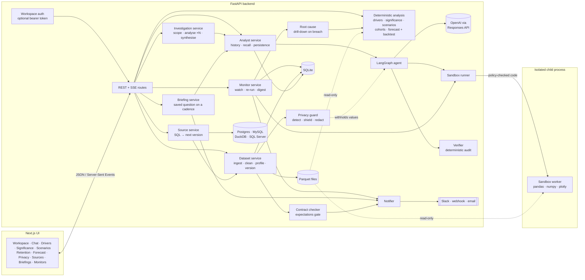
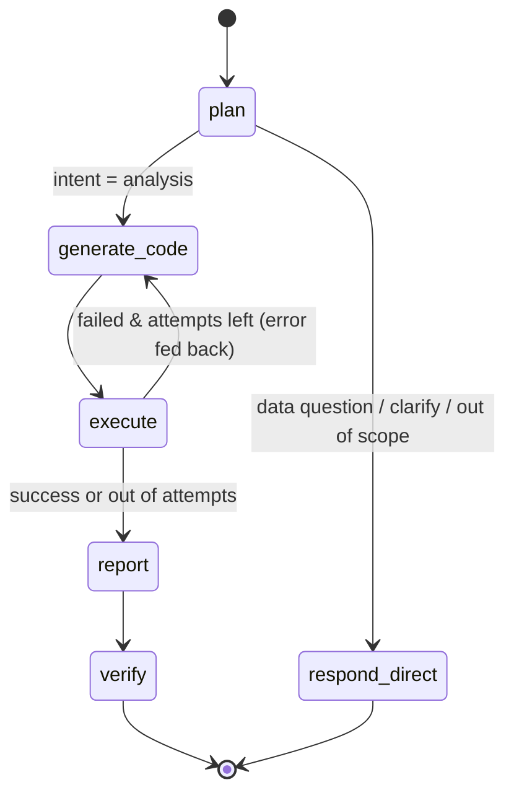

# Numera — Agentic AI Data Analyst

**Upload a CSV or Excel file, ask questions in plain English, and get decision-ready answers.**
Numera inspects and cleans your data, plans an analysis, writes pandas code, runs it in a
secure sandbox, repairs its own mistakes, calculates KPIs, draws interactive Plotly charts
and explains what it all means for the business.

Then it does the part that makes the answer usable: it **verifies every figure it wrote against
the numbers it actually computed**, honours **your** definition of each metric, tells you whether
a difference is **real or just noise**, breaks any change down into **the segments, volume, mix and
rate that caused it**, follows each cohort forward to see **whether what you won stayed won**,
projects the next few periods **with the backtest that earned the projection**, lets you **move the
levers and solve for a target**, finds the personal data in your file and **keeps it out of every
prompt before you have decided anything**, pulls the data straight out of **your warehouse**, holds
next month's load to a **data contract**, keeps watching the KPIs you care about — **telling Slack or
your inbox the moment one breaks, and why** — re-asks your standing questions **on a schedule**, and
hands the whole thing over as a runnable notebook, a real PDF or an editable PowerPoint deck.

Built from scratch with **LangGraph** + **OpenAI** (Responses API) on a **FastAPI** backend
and a **Next.js 16 / React 19 / Tailwind v4** frontend.

### The idea in one line

An LLM is good at deciding *what to compute* and bad at being believed about *what the numbers
mean*. So Numera uses the model for exactly the first job — planning, writing pandas, and writing
prose about results it did not choose — and does everything a reader has to trust in plain,
auditable Python: the cleaning, the profiling, the drill-down, the statistics, the projections, the
contract checks, and the audit that grades the model's own write-up. That split is why an answer
here comes with a verification score instead of a shrug.

---

## Highlights

| | |
|---|---|
| 🧹 **Explainable auto-cleaning** | Encoding & delimiter sniffing, header detection below title rows, currency/percent/thousands parsing, mixed date formats, yes/no → boolean, placeholder (`N/A`, `-`, `#N/A`) → missing, capitalisation variants merged, duplicates and empty rows removed. Every step is logged in an audit trail. Missing values are **never imputed**. |
| 🔎 **Data profiling** | Semantic column roles (measure, dimension, identifier, datetime, …), statistics, top values, date granularity, outlier flags, a data-quality score and dataset-specific suggested questions. |
| 🧠 **LangGraph agent** | `plan → generate code → execute → (self-repair loop) → report`, with intent routing so schema questions are answered instantly without running code. |
| 🛡️ **Safe code execution** | Three defence layers: static AST policy, restricted runtime in a separate process, and a Python audit hook — plus time and memory limits. Secrets never reach the sandbox. |
| 📊 **KPIs, charts & tables** | Formatted KPI tiles with deltas, themed interactive Plotly charts (light & dark), sortable tables with CSV export. |
| ⚡ **Proactive signals** | Deterministic trend, anomaly, seasonality, mix-shift, concentration, correlation and data-quality detectors surface noteworthy findings as soon as a dataset is ingested. |
| 🎯 **Decision playbooks** | One-click executive brief, growth-driver, risk-radar and forecast/opportunity workflows adapt themselves to each dataset's measures, dimensions and dates. |
| ⌨️ **Keyboard-first** | `Ctrl/⌘ K` opens a command palette over every analysis, board, dataset, drill-down, retention grid, projection, contract, privacy review and export. |
| 🔮 **Forecasting in an answer** | Sandboxed analysis code can also call a guarded forecasting helper mid-analysis, so "project this forward" works inside an ordinary question — trend, seasonal estimates and prediction intervals included. The dedicated lab below is where the projection is *proved*. |
| 💡 **Business insights** | Headline answer, narrative, insights with sentiment, recommended actions, caveats and follow-up questions — grounded strictly in computed numbers. |
| 🔍 **Answer verification** | A deterministic audit after every analysis: each figure in the write-up must trace back to a computed value, plus checks for double-multiplied percentages, shares that don't add up, undisclosed missing data, outlier-sensitive averages and ignored metric definitions. Scored, explained and shown to the reader. **No model call.** |
| 🪓 **Driver drill-down** | *Why* did it move? Each segment's contribution and its **surprise** (more or less than its size implies), plus a **volume / mix / rate** shift-share whose three terms add back to the change **exactly**. Dimensions are ranked by how unevenly the change is spread. Waterfall charts, a contributor table and a briefing — **no model call**. |
| 🧪 **Significance lab** | *Is the gap real?* Welch's t-test, Mann-Whitney U or a two-proportion z-test — whichever the measure deserves — a bootstrap interval on the difference itself, effect size, and the smallest difference this sample could have detected. Every segment tested at once with **Benjamini-Hochberg** false-discovery control, so twenty segments stop producing one fake finding. **No model call, no scipy.** |
| 🎚️ **Scenario studio** | *What would have to be true?* Move volume, per-record rate and the mix between segments and read off the projection — decomposed with the same identity as the drill-down, so the forward and backward views reconcile. **Goal seek** solves for the lever that hits a target, and says plainly when nothing reaches it. |
| 👥 **Cohort & retention lab** | *Does what you win stay won?* Group every customer, account or device by the period it first appeared and follow each cohort forward: retention grid, pooled curve, repeat rate, time-to-return, best-against-worst at the same age, and cumulative value per entity. A cohort born last month **cannot** have a six-month rate, so those cells stay empty and are excluded from the average — the difference between a retention curve and a picture of the calendar running out. **No model call.** |
| 🔮 **Forecast lab** | A projection is never shown on its own. Eight methods — including the naive and seasonal-naive baselines — are **refitted from scratch at several origins** and scored on periods no fit ever saw. The winner arrives with its MASE, MAPE and bias, the margin by which it beat the baseline, and a prediction interval built from **its own out-of-sample errors**. When nothing beats the baseline, Numera says so and shows the baseline. **No model call, no statsmodels, no prophet.** |
| 🛡️ **Privacy guard** | Emails, card numbers (Luhn-checked), national identifiers, phone numbers, names, addresses and IPs are found the moment a file lands — and their example values are **stripped from the stored profile**, which is the object every prompt is built from. That happens whether or not anyone reads the warning. Then keep, **mask**, **hash** or drop per column: hashing keeps a stable pseudonym, so retention analysis still works on a customer id whose real value has left the building. The policy is inherited by the next version and re-applied on arrival, salt included. |
| 🔍 **Root cause on breach** | A breached monitor does not just say *what* broke. It runs the driver drill-down on its own measure and attaches the segment, the contribution and the volume/mix/rate term to the run, the digest **and the Slack message** — so the alert names a cause instead of handing you the easy half. Costs one more pass over the same table and **zero tokens**. |
| 🗄️ **Live SQL sources** | Connect Postgres, MySQL, SQL Server, DuckDB or SQLite with one read-only query — joins included, because the database is better at them. Each sync files the result as the **next version**, so the contract is checked on arrival, monitors re-run and the diff tells you what changed. Writes are rejected before a connection opens; credentials never reach the browser. |
| 🧭 **Deep research** | *Investigate* scopes an objective into several questions, runs each through the **full agent graph**, and synthesises one brief. Every sub-analysis is an ordinary message — its code, charts and verification verdict all inspectable, pinnable and exportable — and the synthesis is told which steps failed, so it cannot launder a broken one into confident prose. |
| 🧠 **Analysis memory** | Before a question is planned, the closest prior answers on the same dataset are found by TF-IDF — no embedding model — and shown to you *before the work starts*, so a repeat question can be stopped instead of paid for twice. The agent gets them as continuity context, explicitly labelled as historical. **Ask anywhere**: `/api/route` also picks which dataset a question belongs to. |
| 🗓️ **Scheduled briefings** | A monitor watches one number for free; a briefing re-asks a *question in English* on a cadence and delivers the written answer to Slack or an inbox — with a link to the full analysis, so nobody takes the number on faith. The cost difference is stated in the UI, not buried in the docs. |
| 💬 **Collaboration** | Comment threads anchored to the analysis, board or tile they are about, resolvable as a unit. A workspace **activity feed** shows who uploaded, synced, asked, pinned and shared. Optional **bearer-token access control** turns the open local tool into a shared workspace without inventing a user database. |
| 📐 **Semantic layer** | Define your metrics, rules and glossary once per dataset. They are injected into every prompt as binding instructions — and the verifier flags answers whose code doesn't appear to follow them. |
| 🛡️ **Data contracts** | Expectations the table must keep meeting — schema, types, completeness, uniqueness, ranges, category sets and freshness. Suggested from the first upload, inherited by every version, and checked **the moment new data lands**, so a dropped column is caught on arrival rather than three answers later. |
| 🔔 **Metric monitors** | Watch any KPI. Numera snapshots the code that produced it and re-runs it on demand, on a schedule, or automatically when new data lands — **zero tokens per check** — with thresholds, breach history and a Markdown briefing. |
| 📣 **Alert delivery** | Breaches, recoveries, failed checks and broken contracts reach **Slack, any JSON webhook or email**. Only state *changes* are sent, so a standing breach never becomes a repeating ping, and every attempt is logged with its outcome. |
| 🧾 **Dataset versions** | Re-upload next period's export as a new version: Numera diffs rows, columns, types, measure totals, quality and date coverage, carries your definitions across and re-checks every monitor. |
| 💬 **Chat history** | Persistent sessions (SQLite) with follow-up context, live streaming of agent steps (SSE), stop/retry, Markdown report export. |
| 📌 **Boards & sharing** | Pin KPIs, charts, tables and insights into reusable boards, add Markdown notes, reorder layouts, and create revocable read-only links for analyses or boards. |
| 📤 **Real deliverables** | Export an analysis as a **runnable Jupyter notebook** (the agent's code plus the helper API it calls), a **vector PDF**, or an **editable PowerPoint deck with native charts** a colleague can restyle. Boards export to PDF and PPTX too. Download the cleaned table to reproduce every figure yourself. |
| 🖨️ **Stakeholder reports** | Dedicated print layouts turn an analysis or board into a clean browser printout; model token usage and estimated cost are tracked per analysis. |
| 💵 **Spend guardrail** | A visible monthly AI budget meter warns at 80% and pauses new model calls at the configured cap, making BYO-key costs predictable. |
| 🧯 **Error handling** | Typed error codes end-to-end, graceful degradation (results survive a failed write-up), actionable UI banners and toasts. |

---

## Architecture



Everything below the agent — profiling, signals, driver analysis, significance testing, scenario
projection, cohort retention, forecasting and its backtest, personal-data detection, analysis
recall, verification, contracts, monitor checks and the root-cause drill-down attached to a breach
— is plain Python over the cleaned table. That is deliberate: those are the parts a reader has to
be able to trust, so none of them can cost a token or invent a number. The two features that *do*
spend tokens — investigations and scheduled briefings — say so plainly in the interface rather than
in a footnote.

### The agent graph



| Node | What it does |
|---|---|
| **plan** | Classifies intent, resolves follow-up references from chat history, and produces analysis steps, KPI definitions, chart specs and assumptions (structured output). |
| **generate_code** | Writes a pandas/Plotly program against the schema card. In repair mode it receives the failing code and the error (with line number and available columns). |
| **execute** | Runs the program in the sandbox and collects KPIs, charts, tables and printed output. |
| **report** | Turns the *actual* results into a headline, narrative, insights, recommendations, caveats and follow-ups. Receives the deterministic data checks so it can own the caveats. If this step fails, the computed results are still returned. |
| **verify** | Audits the finished answer against the executed output and scores it. Pure Python — no model call, no added cost, no chance of hallucinating its own verdict. |
| **respond_direct** | Answers schema-level questions straight from the profile — no code, no waiting. |

Each node emits progress events through LangGraph's custom stream, which the API relays
to the browser as Server-Sent Events, so users watch the agent think, code, fail, fix and
conclude in real time.

**LLM details.** All calls use OpenAI (`gpt-5.6-luna` by default) through the official Python
SDK and the **Responses API**, with Pydantic **Structured Outputs** (`responses.parse`),
configurable reasoning effort, automatic prompt caching and programmatic refusal handling.
Requests are stateless (`store=False`). Nodes depend on a small `StructuredLLM` protocol,
so the whole graph is unit-tested with a scripted fake model.

---

## Safe code execution

Model-written code is untrusted. Numera treats it that way:

1. **Static policy** (`app/sandbox/policy.py`) — the AST is checked before anything runs:
   allow-listed imports only (pandas, numpy, plotly, a few safe stdlib modules); no `open`,
   `eval`, `exec`, `getattr`, `__import__`; no dunder or private attribute access; no file/IO
   methods (`to_csv`, `read_*`, `write_html`, …); no `DataFrame.query/eval`; no `fig.show()`.
   Violations are returned to the model as fixable errors.
2. **Restricted runtime** (`app/sandbox/worker.py`) — the code runs in a **separate Python
   process** (`python -I`) with a stripped-down environment (no API keys or other secrets),
   a throwaway working directory, restricted builtins and an import guard.
3. **Audit hook** — `sys.addaudithook` blocks process spawning, sockets, `ctypes`, file
   writes, file reads outside the Python installation, directory listing and imports of
   dangerous modules, even if something slipped past layer 1.
4. **Resource limits** — wall-clock timeout and memory cap enforced by a `psutil` watchdog
   in the parent (process tree is killed), output-size caps, plus CPU/file-size/no-fork
   `rlimit`s on Linux/macOS.

> **Deployment note.** These layers make the sandbox robust against accidental and
> casual misuse, but an in-process-language sandbox is not a hard security boundary. For
> multi-tenant or internet-facing deployments, additionally run the backend in a container
> with no outbound network (except the OpenAI API), a read-only root filesystem, and
> ideally a kernel-level sandbox such as gVisor, Firecracker or nsjail.

---

## Trust: verification and the semantic layer

The hard problem with an AI analyst is not producing an answer — it is knowing whether to
believe one. Numera addresses that deterministically, in Python, with no second opinion from
a model that could be wrong in the same direction as the first.

### What gets checked

After the write-up is generated, `app/services/verification.py` audits it:

| Check | What it catches |
|---|---|
| **Number grounding** | Every figure in the headline, narrative and insights must match a KPI, table cell, chart value or printed result — allowing for compact (`$1.2M`) and percent (`23.4%` ↔ `0.234`) renderings. Unmatched figures are named and flagged. Numbers from your own question are excluded. |
| **Percent / delta scale** | A percent-formatted KPI above 1.5, or a delta above 10 — the classic "multiplied by 100 twice" bug. |
| **Share totals** | A share/percentage column that doesn't sum to 1 or 100% across a complete breakdown. |
| **Missing data disclosure** | Columns with ≥5% gaps used in the analysis and mentioned in neither the answer nor its caveats. |
| **Outlier-sensitive averages** | A mean taken over a column with values beyond 3×IQR. |
| **Small groups** | Per-group rates computed on fewer than five records. |
| **Metric definitions** | A metric you defined is part of the question, but none of the terms in your definition appear in the code. |
| **Empty or broken output** | Code that ran but emitted nothing, or KPIs with no value. |
| **Self-repairs** | Surfaces that the code needed fixing before it worked. |

Findings are weighted into a 0–100 score and a confidence band, shown in the UI, and carried
into every export. Material findings are also fed *back into* the report prompt before it is
written, so the model addresses them in its caveats instead of glossing over them.

### Your definitions, not the model's

A model that decides for itself what "revenue" means will decide differently next Tuesday.
The **Metrics** tab of the data panel stores per-dataset:

- **Metric definitions** — `Net revenue: gross sales minus refunds and cancellations`
- **Rules** — `Exclude internal test orders`, `The fiscal year starts in April`
- **Glossary** — business terms the model should use the way you use them

These are injected as a separate, authoritative prompt block (kept after the stable schema card
so prompt caching still works), and they survive dataset re-uploads. The verifier then checks
that the code actually honoured them.

---

## Drivers: not *what* changed, but *why*

"Revenue fell 12%" is half an answer. The half that matters is which segments moved, whether the
business sold less or sold cheaper, and how much of the change is just the mix tilting. The
**Drivers** view answers that in pandas — free, instant, and identical every time you ask.

### Three numbers that add up

`app/services/drivers.py` splits the change between two equal-length periods:

| | What it answers |
|---|---|
| **Contribution** | What each category added or removed, and its share of the total move. |
| **Surprise** | Contribution *minus* what the category's baseline size implies — the part you would not have guessed from "it's our biggest region". |
| **Shift-share** | The change split into **volume** (more or fewer records), **mix** (share moving between categories) and **rate** (average value per record). |

The shift-share identity is exact, and the code checks it:

```
volume = (N₁ − N₀) · avg₀
mix    = N₁ · Σ (s₁ᶜ − s₀ᶜ) · avg₀ᶜ
rate   = N₁ · Σ s₁ᶜ · (avg₁ᶜ − avg₀ᶜ)
        ────────────────────────────
        volume + mix + rate = current − baseline
```

Every result carries `residual` and `closes`; a decomposition that does not reconcile says so in
its own caveats instead of quietly rounding.

### Which dimension actually explains it

Each dimension is scored by `Σ|surpriseᶜ| / |baseline total|` — how far its categories deviate from
everything moving in proportion. It is scale-free, so dimensions of the same measure are directly
comparable, and it is near zero for a dimension that just splits the change evenly (a channel that
grew exactly in line with the business explains nothing). The best-scoring dimension leads; one
click looks through any other.

### Everything else it tells you

- **Periods** are equal-length trailing windows anchored at the newest record (12 months, 30 days,
  4 weeks) — no partial-calendar bias — or a custom range, or a split in half when history is short.
- **New and lost categories** are surfaced separately: a segment that did not exist last period is
  invisible in a percentage change.
- **Non-additive measures** (prices, rates, percentages) are averaged rather than summed, and the
  volume term is dropped because it does not apply.
- **Hand-off**: one button opens a chat session pre-loaded with the question this drill-down raises,
  so the agent starts where the arithmetic stopped. Waterfalls and contributor tables pin to boards
  (recomputed and snapshotted server-side), and the whole thing exports as a Markdown briefing.

Signals link straight into it: the "Break it down" action on a trend, anomaly, mix-shift or
concentration card opens the drill-down already aimed at that measure and dimension.

---

## Significance: is the difference real, or is it noise?

Every analyst tool will happily report that Segment A converts at 4.1% and Segment B at 3.8%.
Almost none of them mention that on 210 and 190 records the gap is indistinguishable from a coin
landing slightly differently — which is the only part a decision actually hangs on.

`app/services/statistics.py` answers that in plain Python. The distribution functions are
implemented in the module (`erf` for the normal, a continued-fraction incomplete beta for
Student's *t*), so **there is no scipy dependency** and the arithmetic is auditable.

| | What it gives you |
|---|---|
| **The right test** | Welch's t-test for means (unequal variances, because almost nothing in a business dataset shares one), a **two-proportion z-test** when the measure is binary, and **Mann-Whitney U** alongside — rank-based, so a handful of outliers cannot manufacture a difference. |
| **An interval, not just a verdict** | A seeded percentile **bootstrap** on the difference itself. "Somewhere between −2% and +9%" is a more useful sentence than "p = 0.31", and the seed means the interval does not move when you refresh the page. |
| **Effect size** | Cohen's *d*, Hedges' *g* (small-sample corrected) and Cliff's delta, so a statistically significant difference that is commercially irrelevant is visible as exactly that. |
| **Honest power** | The smallest difference this sample could have detected at 80% power — reported in the measure's own units. |
| **Multiple-testing control** | Scanning every category of a dimension at once is *N* chances to find a one-in-twenty fluke. The scan applies **Benjamini-Hochberg** FDR control and reports both counts, so you can see how many findings the correction removed. |

### Three verdicts, not two

A p-value above the threshold means two completely different things depending on how much data
you had, and collapsing them is how "no significant difference" becomes "no difference":

- **Real** — the interval excludes zero.
- **Not distinguishable** — the gap is within chance, **and** the sample was large enough to have
  caught a difference that matters. A genuine null, which is a finding.
- **Not enough data** — the same p-value, but this comparison could only have detected an effect
  larger than anyone would call small. "We don't know", stated as such.

That distinction rests on a deliberate choice: the power reported is **prospective**, never
observed (post-hoc) power. Power computed from the effect the data happened to show is a monotone
function of the p-value — it carries no information the p-value did not, and it makes every null
result look inconclusive, including a well-powered real one. The comparison is called adequately
powered when its minimum detectable effect is at or below a medium standardised effect
(*d* = 0.5); the MDE is also published in the measure's own units, so a reader who knows what size
actually matters to their business can apply their own threshold instead.

---

## Scenarios: what would have to be true?

The drill-down explains a change that already happened. This is the same arithmetic pointed
forwards — hold the shape of the business fixed, move one lever, read off what the measure becomes.

- **Levers that respect structure.** Volume (how many records), rate (average value per record)
  and mix (the share each segment holds) move independently, per segment or across the board.
  Moving mix redistributes the remaining share across the untouched segments in proportion, so the
  shares still sum to one — a "what if Enterprise were 40% of the book" that quietly leaves the
  others adding to 75% is not a scenario. Requests that exceed 100% are scaled back proportionally
  rather than silently clipped.
- **The same decomposition as the drill-down.** The projected change is split into volume, mix and
  rate using `drivers.shift_share`, the identical function the backward-looking view uses. A
  what-if that did not reconcile the way the drill-down does would be telling the reader two
  different stories about one table.
- **Leverage, not size.** Each segment is scored by what a 1% lift in its average value adds,
  relative to its share of records — so a segment that is 8% of the book but carries triple the
  average value is visibly the lever worth pulling.
- **Goal seek.** Name a target instead of a lever and bisection finds the value that reaches it.
  Because the projection is monotonic in a single lever, the solver can say honestly that *no*
  value in the allowed range gets there, and report the range it can actually reach — rather than
  silently returning the closest it managed.

---

## Cohorts: does what you win stay won?

Drivers, significance and scenarios all look at a *period*. This looks at a *population over
time*: group every entity by the period it first appeared, then follow each group forward and read
off how much of it is still there.

Most cohort grids are quietly wrong in the same way, and it is worth naming.

### Right-censoring, handled rather than ignored

A cohort born last month has not had six months in which to churn. If its six-month cell is
counted as `0`, the average curve is not measuring retention — it is measuring how much of the
calendar has elapsed, and it will look worse every month no matter what the business does.

So an unobserved cell is `null`, never zero, and the pooled curve at each offset is computed
**only over the cohorts that have actually lived that long**, weighted by cohort size. The UI
prints the number of cohorts behind every point on the curve, so a reader can see when the tail is
three cohorts rather than fourteen. The partial final period is dropped and disclosed for the same
reason: a month that is three days old always looks like a collapse.

### What it reads off the grid

| | |
|---|---|
| **Retention grid** | Each row is one cohort, each column how many periods later. Newest first, oldest folded into a count so the heat map stays readable. |
| **Pooled curve** | Size-weighted across every eligible cohort, plus the three newest cohorts drawn faintly behind it so the spread the average hides is visible. |
| **Repeat rate & one-and-done** | What share ever comes back at all, and what share appears exactly once. |
| **Time to return** | The median gap before a returner returns — anything measured over a shorter window under-counts repeats, and says so. |
| **Best against worst** | The strongest and weakest cohort *at the same age*, so the comparison is like-for-like rather than an artefact of one being younger. |
| **Value per entity** | With a measure selected: cumulative **observed** value per entity, and a revenue-retention ratio against the first period. It is not an LTV projection and does not pretend to be one — the line stops where the data does. |

The entity column is picked by what it is called, not by what repeats most: `Customer ID` beats
`Customer Email` (an id is the stable key; a contact detail changes), and both beat `Product`,
however often a product repeats.

---

## Forecasting: the projection and its track record, or neither

A projection is easy to produce and hard to believe. Numera's answer is the one it gives
everywhere else — don't ask the reader to take it on faith, show the evidence:

> **Nothing is forecast without the walk-forward backtest that chose it.**

Eight methods — naive, seasonal naive, recent mean, drift, linear trend, trend + seasonality,
damped trend, damped trend + seasonality — are **refitted from scratch at each of up to six
origins** and scored over the horizon actually being asked for, on periods no fit ever saw.

### Why MASE leads

`MASE` is the headline number because it is scale-free and has an honest zero point: **1.0 means
"no better than the baseline"**. A method that cannot clear its own baseline has not earned a
place on the page, and the verdict says so in those words:

| Verdict | What it means |
|---|---|
| **Beats the baseline** | Cut out-of-sample error against the best of naive / seasonal naive by more than 2%. |
| **Weak** | Won the race but still scores MASE ≥ 1 — worse than a one-step naive forecast on this history. |
| **No better** | Within 2% of the baseline. Read the projection as a trajectory, not a number. |
| **Baseline is the answer** | Nothing beat doing nothing, so the baseline is what is shown. *That is a finding, not a failure*: this series has no structure worth modelling. |

### Intervals that come from evidence

The prediction interval is the empirical spread of **this method's own out-of-sample errors at
each horizon step** — not a normality assumption about the residuals it was fitted on. That is why
it widens with the horizon by itself, and why the "how the error grows" chart and the band are the
same measurement twice. Where there is not enough held-out history at a step, the interval falls
back to the residual spread scaled by √h and the result says which of the two it used. A band is
never allowed to *narrow* with the horizon: a forecast does not become more certain further out,
whatever a quantile over four folds happens to say.

Fairness is enforced too: seasonality is only offered when there are two full cycles **plus room
for a fold**, so every candidate can be fitted at every origin, and any method that could not be
is shown on the scoreboard but never allowed to win.

---

## Privacy: the model never sees the email address

Every convenience in an analyst tool is a way for a value to travel — the schema card sent to the
model, the sample rows in the UI, a share link, a PDF mailed to a colleague. So the guard works in
two stages, and **the first one needs no decision from anybody**.

### 1. Detect and quarantine, at upload

Columns are scanned with validated matchers — **Luhn** for card numbers, octet ranges for IP
addresses, a real email grammar — plus column-name signals. Anything flagged with high confidence
has its example values stripped from the **stored profile**, which is the object `dataset_context()`
turns into the model's schema card. The model still gets the column's name, type, role and
statistics, and a line telling it the values are withheld and must not be guessed at. It never
gets a value. This happens whether or not anyone reads the warning.

Detection is deliberately conservative about the shapes that are cheap to over-call:

- A 16-digit order number is **not** a card number, because Luhn says so.
- A bare run of eleven digits is **not** a phone number — unless the column is called `phone`,
  which switches on the looser matcher for that column only.
- `Air Fryer` is **not** a person's name. Title-cased two-word values are most of a product
  catalogue, so `person_name` only fires when the column name agrees.
- A short alphanumeric reference is **not** a postcode for the same reason.

### 2. Redact, on a decision

Keep, **mask**, **hash** or drop, per column.

| Action | What it does |
|---|---|
| `mask` | Rewrites values in place, keeping shape and the last four characters — enough to confirm "yes, that is the right record", and nothing else. |
| `hash` | A salted SHA-256 pseudonym. The same value always produces the same pseudonym within the lineage, so **grouping, joins and the entire retention view still work** on a customer id whose real value has left the building. |
| `drop` | The column is removed. |

Applying a policy rewrites **the one cleaned table** that the preview, the sandbox, every export,
every share link and every board tile all read — so none of them has to remember to filter, and
none of them can forget. The original upload is deleted in the same step, because keeping it would
defeat the redaction, and the policy and its salt are **inherited by the next version and
re-applied on arrival**: next month's export cannot quietly re-introduce what last month's
redaction removed.

> Detection finds what it recognises. A free-text comment box can always hold something no pattern
> can see, and the UI says so rather than implying a guarantee it cannot make.

---

## Live SQL sources: the numbers that matter are not in a CSV

An analyst product that only reads files is one people stop using the moment the stakes rise,
because the data lives in a warehouse. A source is a connection string plus **one read-only
query**; syncing it files the result as the next **version** of a dataset, which means every
existing guarantee applies to it unchanged — the same deterministic cleaning and audit trail, the
same profile, the same data contract checked on arrival, the same monitors re-run, the same
version diff.

Multi-table analysis comes free with that shape: the join lives in the query, where the database
can optimise it, and Numera receives one clean rectangle.

| Guard | How |
|---|---|
| **Read-only by construction** | The statement must be a single `SELECT` or `WITH`. A second statement, a stacked query or any DDL/DML keyword is rejected *before a connection is opened*. String literals and comments are stripped before the keyword check, so `WHERE action = 'delete'` is data — not a false positive — and a write hidden after a `--` comment is not a false negative. Where the driver supports it the session is opened read-only too. |
| **Bounded** | Rows stream in chunks and stop at `MAX_ROWS`, so a mistyped `FROM` cannot pull a billion rows into memory. |
| **Credentials stay server-side** | The DSN is stored for reuse and never returned to a client unredacted, and passwords are stripped from error text before it is logged or shown — a failing connection must not become a way to read the password. |

Dialects ship with SQLAlchemy; the drivers are optional extras, and an error names the exact
package to install (`psycopg[binary]`, `pymysql`, `pyodbc`, `duckdb-engine`) rather than failing
with an import trace.

---

## Deep research: several analyses, one brief

A single question gets a single answer, and a single answer is rarely what anyone needed. "Why is
retention falling" is four analyses — what the level and trend actually are, which cohorts moved,
whether that movement is distinguishable from noise, and what it would take to reverse it — plus
the work of reconciling them.

```
scope (one model call) → analyse ×N (the ordinary agent graph, per question) → synthesise (one call)
```

The important design choice is that the middle is **not special**. Each sub-question goes through
the same `plan → code → execute → repair → report → verify` graph and is persisted as an ordinary
assistant message, so every sub-analysis keeps its code, its charts and its verification verdict —
and every existing capability (pin to a board, export a notebook, watch a KPI, share a link) works
on it with no new code. The brief on top is stored in the standard report shape, so PDF,
PowerPoint and the share page render it with no special case.

The synthesis prompt receives, for each step, what was *actually computed* — including which steps
failed and which figures the verifier flagged — and is instructed not to launder them into
confident prose. An investigation that quietly builds on a broken step is worse than one that
admits it. Failed steps are also named in the brief's caveats automatically, whatever the model
writes.

---

## Analysis memory: "you asked this in March"

Two problems grow with every week a team uses an analyst tool: the same question gets asked four
times and answered four slightly different ways, and by the third dataset nobody is sure which
file a question should be pointed at.

Both are retrieval problems, and both are solved with TF-IDF cosine similarity over the questions,
headlines and column vocabulary already in SQLite — **no embedding model**, which keeps recall
free, instant, offline and inspectable: every match reports the terms it actually matched on.

- **Recall** runs *before* the question is planned. The notice appears above the streaming
  timeline while the agent is still thinking, so a reader who recognises the earlier answer can
  stop the run instead of paying for it twice. The agent receives the same matches as continuity
  context, explicitly labelled as historical and non-authoritative — and the verifier flags any
  number it repeats that this run did not compute.
- **Routing** (`POST /api/route`) ranks which dataset can answer a question, matching against
  column names *and* the category values they hold — so "how many engineering staff" finds the
  table with `Engineering` inside its `department` column, not merely the one called "Headcount".
  It reports the terms nothing matched, and claims confidence only when the winner is clearly ahead.

---

## Briefings and collaboration

**Scheduled briefings** are the other half of monitors. A monitor re-runs snapshotted code to
watch one number and costs nothing; a briefing re-runs the whole agent to answer a *question in
English* on a cadence and delivers the written answer to Slack or an inbox. Each run is an
ordinary analyst turn in its own session, so the delivered summary always links back to a full
analysis with its code, charts and verification attached. The cost difference is stated in the
interface, because a feature that quietly spends money is a bug.

**Comments** anchor a discussion to the artifact it is about — an analysis, a board, or one pinned
tile. Threads are one level deep on purpose (a reply to a reply is a meeting), and resolving a
thread resolves its replies, because a half-resolved thread is a to-do list nobody trusts.

**Activity** is an append-only, bounded feed of who uploaded, synced, asked, investigated, pinned
and shared. Recording an entry can never fail the action it describes — every call swallows its own
errors — because an audit line is a description of something that already succeeded.

**Access control** is opt-in and deliberately small. Unset, the workspace is open, which is right
for a tool pointed at your own laptop. Set `WORKSPACE_TOKENS` to `token:Display Name` pairs and
every API call needs a bearer token, with the matched name attributed to the comments and activity
that person leaves. There are no passwords to leak, no sessions to fixate and no roles to get
wrong — it is a shared secret per person, honest about what it protects. Public share links keep
working either way: they carry their own unguessable token and are read-only by construction.

> **Scope note.** This is team-level access control, not multi-tenancy: everyone who holds a token
> sees the same workspace. Per-user data isolation would need a real identity model and row-level
> ownership, and pretending otherwise would be worse than saying so.

---

## Data contracts: next month's file is checked, not just diffed

The version diff tells you what changed. A contract tells you whether that was **allowed**.

Numera proposes one from the first upload's profile — every column present and still its type,
completeness within a few points of today's, identifiers unique, non-negative measures staying
non-negative, small category sets closed, a row-count floor, and a freshness limit derived from the
current lag. You trim it; it is then inherited by every later version and evaluated **as the upload
lands**.

| Expectation | Catches |
|---|---|
| `schema` | A renamed or dropped column, a date column arriving as text |
| `not_null` | A join that started producing gaps |
| `unique` | Duplicated rows from a double export |
| `range` | Negative revenue, a percentage stored as 0–100 instead of 0–1 |
| `allowed_values` | A new status code nothing downstream knows how to treat |
| `row_count` | A truncated file |
| `freshness` | A pipeline that stopped three weeks ago |

Each expectation is `fail` (blast radius: every analysis) or `warn` (a distribution drifted), and
can be muted without deleting it. The verdict is scored, shown in the data panel, attached to the
version in the timeline, exported as Markdown — and **delivered as an alert** when it breaks.

Checks are pure pandas and individually sandboxed against their own failure: a broken expectation
logs and is reported, never blocks an upload.

---

## Alerts: somebody actually finds out

A watched metric that breaks while nobody is looking is not a monitor, it is a log line.

- **Channels** — a Slack webhook (rendered as Block Kit with colour and a link back), any JSON
  endpoint (a stable `{source, event, severity, title, summary, facts, link}` document), or email
  over SMTP.
- **Events** — `breach`, `recovery`, `failure` (the snapshotted analysis stopped running),
  `contract` and `digest`. Each channel subscribes to what it wants.
- **Transitions only** — a monitor still breached on its fortieth sweep has not changed. Crossing
  the line, and crossing back, are the events.
- **Failure is visible** — every attempt is logged with its outcome, one dead webhook never blocks
  the others, and a test send reports the real error. URLs are stripped from error text, so a
  webhook secret cannot leak into the delivery log.
- **Briefings** — the monitor digest can be pushed on demand or on a cadence (`ALERT_DIGEST_HOURS`).

---

## Monitors: the answer keeps working after you close the tab

Click the eye icon on any KPI. Numera snapshots **the code that produced it**, which makes
re-checking that number a single sandbox run and **zero model tokens**.

- **Rules** — alert when the metric rises above, falls below, or moves by more than *x*%
- **When** — on demand, on an optional interval (`MONITOR_INTERVAL_MINUTES`), and automatically
  whenever a new version of the dataset is uploaded
- **History** — every observation kept (bounded), with sparklines, change since last check and
  human-readable breach detail
- **Briefing** — `GET /api/monitors/digest.md` renders a stakeholder-ready Markdown summary

Because the check re-executes real code against real data, a monitor reports *failure* when the
analysis no longer applies (renamed column, missing KPI) rather than quietly serving a stale number.

### And when it breaks, it says why

"Revenue is below target" is the easy half of the answer. The half that matters is *which segment
did it* — and Numera already computes that deterministically for any measure in the table, so the
moment a monitor breaches it runs the driver drill-down and attaches the result to the run.

1. **Which measure?** Worked out from the KPI's own label, then the question behind the monitor,
   then the snapshotted code — a column referenced in the code that computed the number is at
   least in the neighbourhood of the right answer. The UI says which of the three it matched on.
2. **The drill-down.** Best-scoring dimension, the top contributors with their share of the move,
   and the largest of the volume / mix / rate terms.
3. **Everywhere it is read.** The run, the monitor card, the Markdown digest **and the Slack or
   email alert**, which now carries a *Most likely driver* field instead of a number and a shrug.
   One click opens the full drill-down pre-aimed at the same measure and dimension.

It costs one more pass over the same cleaned table and **zero tokens**, and it is best-effort by
design: a dataset with no dates or nothing to segment by still gets its breach alert, without the
explanation and saying so. `POST /api/monitors/{id}/diagnose` asks for it on demand, breached or
not. Set `MONITOR_ROOT_CAUSE=false` if a very large table makes the sweep too slow.

---

## Reproducible deliverables

| Export | What you get |
|---|---|
| **Jupyter notebook** (`.ipynb`) | The agent's code, unchanged, plus a self-contained shim defining the `kpi` / `table` / `chart` / `forecast` / `chart_forecast` helpers it calls — so every cell runs in your own environment. Includes the cleaning trail and the verification verdict. |
| **PDF** | A real vector document: KPI tiles, insights, recommendations, caveats and data tables, with charts rebuilt as reportlab vector graphics from the figure digest. |
| **PowerPoint** (`.pptx`) | An editable deck where charts are **native PowerPoint chart parts** with their data embedded — a colleague can restyle them or re-point them at new numbers. |
| **Cleaned data** | The exact post-cleaning table as CSV or Parquet, so the notebook reproduces every figure. |

No headless browser, no image rasterisation, no extra binaries — charts are reconstructed from
the numeric digest the sandbox already captures for every figure.

---

## Quick start

### Prerequisites
- Python **3.11+** (3.12 recommended)
- Node.js **20.9+** (22 LTS recommended)
- An [OpenAI API key](https://platform.openai.com/api-keys)

### 1. Configure

```bash
cp .env.example .env        # Windows: copy .env.example .env
# then set OPENAI_API_KEY=... in .env
```

### 2. Backend

```bash
cd backend
python -m venv .venv
# macOS/Linux:
source .venv/bin/activate
# Windows (PowerShell):
.venv\Scripts\Activate.ps1

pip install -r requirements-dev.txt
uvicorn app.asgi:app --reload --port 8000
```

API docs are served at <http://localhost:8000/docs>.

### 3. Frontend

```bash
cd frontend
cp .env.example .env.local   # optional; defaults to http://localhost:8000
npm install
npm run dev
```

Open <http://localhost:3000>, click **Try sample retail data** (or upload your own file) and ask away.

### Docker

```bash
cp .env.example .env   # add your key
docker compose up --build
```

Frontend on `:3000`, backend on `:8000`, data persisted in the `numera-data` volume.

---

## Configuration

All settings are environment variables (read from `.env` at the repo root or in `backend/`).

| Variable | Default | Description |
|---|---|---|
| `OPENAI_API_KEY` | — | **Required** for analysis. |
| `OPENAI_MODEL` | `gpt-5.6-luna` | Cost-sensitive OpenAI model for planning, coding and reporting. |
| `ANALYST_EFFORT` | `low` | `low` · `medium` · `high` · `xhigh` · `max` — trades depth for latency and cost. |
| `LLM_MAX_TOKENS` | `8000` | Maximum output tokens for each model call. |
| `AI_MONTHLY_BUDGET_USD` | `5` | Calendar-month estimated-spend guardrail; set to `0` to disable. |
| `MAX_REPAIR_ATTEMPTS` | `2` | Automatic code fixes before giving up. |
| `HISTORY_TURNS` | `6` | Prior turns summarised as context for follow-up questions. |
| `RECALL_ENABLED` | `true` | Find prior answers to a similar question. Deterministic; no model call. |
| `RECALL_LIMIT` | `3` | How many prior analyses to surface and hand to the planner. |
| `INVESTIGATION_MAX_STEPS` | `4` | Analyses per deep-research run. Cost ≈ this many questions, plus two calls. |
| `BRIEFING_INTERVAL_MINUTES` | `0` | Sweep for saved questions due to re-run; `0` disables it. **Each run costs tokens.** |
| `SOURCE_SYNC_INTERVAL_MINUTES` | `0` | Sweep for connected databases due to refresh; `0` disables it. Each source also has its own interval. |
| `WORKSPACE_TOKENS` | — | `token:Name` pairs. Empty leaves the workspace open; set it to require a bearer token and attribute actions to people. |
| `SANDBOX_TIMEOUT_S` | `60` | Wall-clock limit per execution. |
| `SANDBOX_MEMORY_MB` | `2048` | Memory limit per execution (process tree RSS). |
| `MONITOR_INTERVAL_MINUTES` | `0` | Background monitor sweep interval; `0` disables the scheduler (monitors still run on demand and on new dataset versions). Checks cost no model tokens. |
| `MONITOR_HISTORY_LIMIT` | `60` | Observations kept per monitor. |
| `MONITOR_ROOT_CAUSE` | `true` | Run the driver drill-down when a monitor breaches and attach it to the run, the digest and the alert. One extra pass over the cleaned table; no tokens. |
| `PRIVACY_SCAN_ENABLED` | `true` | Run personal-data detection at upload. Detected values are withheld from every prompt regardless; this only controls whether the detector runs. |
| `ALERTS_ENABLED` | `true` | Master switch for Slack / webhook / email delivery. |
| `ALERT_TIMEOUT_S` | `10` | Per-delivery timeout. |
| `ALERT_DIGEST_HOURS` | `0` | Scheduled monitor briefing; `0` disables it (state changes still alert). |
| `PUBLIC_BASE_URL` | `http://localhost:3000` | Used for the "open in Numera" link inside an alert. |
| `SMTP_HOST` … `SMTP_STARTTLS` | — | Email alerts stay unavailable until `SMTP_HOST` is set. |
| `MAX_UPLOAD_MB` | `50` | Upload size limit. |
| `MAX_ROWS` | `2000000` | Row limit per dataset. |
| `DATA_DIR` | `backend/data` | SQLite database and Parquet files. |
| `CORS_ORIGINS` | `http://localhost:3000,…` | Comma-separated allowed origins. |
| `NEXT_PUBLIC_API_URL` | `http://localhost:8000` | *(frontend)* Backend URL as seen by the browser. |

---

## API

| Method | Path | Purpose |
|---|---|---|
| `GET` | `/api/health` | Status, model, credential detection, limits |
| `POST` | `/api/datasets` | Upload (`multipart/form-data`: `file`, optional `sheet`, optional `replaces`) → cleaned & profiled dataset. `replaces` files it as a new version and re-checks that dataset's monitors |
| `POST` | `/api/datasets/sample` | Load the bundled sample dataset |
| `GET` | `/api/datasets` · `/api/datasets/{id}` | List (newest version per lineage) / detail (profile + cleaning + semantics + version diff) |
| `GET` | `/api/datasets/{id}/preview?offset=&limit=` | Paginated rows |
| `GET` | `/api/datasets/{id}/versions` | Every upload in the lineage, each with its diff |
| `GET` · `PUT` | `/api/datasets/{id}/semantics` | Read / replace the binding metric definitions, rules and glossary |
| `GET` · `PUT` | `/api/datasets/{id}/contract` | Read the expectations and their last verdict / replace them (re-checked immediately) |
| `POST` | `/api/datasets/{id}/contract/suggest` · `/check` | Propose a contract from the profile (not saved) / re-evaluate now |
| `GET` | `/api/datasets/{id}/contract.md` | The contract and its verdict as a Markdown briefing |
| `GET` | `/api/datasets/{id}/drivers/options` | Measures, dimensions and date columns a drill-down can use |
| `POST` | `/api/datasets/{id}/drivers` | Decompose a measure's change — contributions, shift-share, waterfalls. **No model call** |
| `POST` | `/api/datasets/{id}/drivers/export.md` | The same drill-down as a Markdown briefing |
| `GET` | `/api/datasets/{id}/significance/options` | Measures (mean or proportion), segments and dates a test can use |
| `POST` | `/api/datasets/{id}/significance` | Test two groups or two periods: tests, bootstrap CI, effect size, power, BH-corrected scan. **No model call** |
| `POST` | `/api/datasets/{id}/significance/export.md` | The same test as a Markdown briefing |
| `GET` | `/api/datasets/{id}/scenarios/options` | Measures, segmentations and periods a scenario can be built on |
| `POST` | `/api/datasets/{id}/scenarios` | Project a measure under volume / rate / mix levers. **No model call** |
| `POST` | `/api/datasets/{id}/scenarios/goal-seek` | Solve for the lever value that reaches a target — or report that none does |
| `POST` | `/api/datasets/{id}/scenarios/export.md` | The scenario as a Markdown briefing |
| `GET` | `/api/datasets/{id}/cohorts/options` | Entity, date and value columns a cohort grid can be built from |
| `POST` | `/api/datasets/{id}/cohorts` | Retention by cohort, respecting right-censoring. **No model call** |
| `POST` | `/api/datasets/{id}/cohorts/export.md` | The retention grid as a Markdown briefing |
| `GET` | `/api/datasets/{id}/forecast/options` | Measures, dates, grains and the eight candidate methods |
| `POST` | `/api/datasets/{id}/forecast` | Project a measure forward *with* the walk-forward backtest that chose the method. **No model call** |
| `POST` | `/api/datasets/{id}/forecast/export.md` | The projection and its scoreboard as a Markdown briefing |
| `GET` · `PUT` | `/api/datasets/{id}/privacy` | The scan and the redaction policy / replace the policy (nothing is rewritten yet) |
| `POST` | `/api/datasets/{id}/privacy/scan` | Re-run detection against the table as it stands now |
| `POST` | `/api/datasets/{id}/privacy/apply` | **Irreversible.** Rewrite the cleaned table under the policy and purge the original upload |
| `GET` | `/api/datasets/{id}/privacy.md` | The findings, the policy and the redaction audit trail as Markdown |
| `GET` | `/api/datasets/{id}/download?format=csv\|parquet` | The cleaned table |
| `DELETE` | `/api/datasets/{id}` | Delete dataset and its sessions |
| `GET` · `POST` | `/api/sessions` | List / create chat sessions |
| `GET` · `PATCH` · `DELETE` | `/api/sessions/{id}` | Detail with messages / rename / delete |
| `POST` | `/api/sessions/{id}/chat` | Ask a question — **SSE stream** |
| `POST` | `/api/sessions/{id}/investigate` | Deep research: scope an objective, run several analyses, synthesise a brief — **SSE stream** |
| `GET` | `/api/sessions/{id}/export` | Download the conversation as a Markdown report |
| `GET` | `/api/sessions/{id}/notebook` | Download a runnable Jupyter notebook |
| `GET` | `/api/sessions/{id}/export.pdf` · `.pptx` | Download a PDF document / editable PowerPoint deck |
| `POST` · `DELETE` | `/api/sessions/{id}/share` | Create / revoke a read-only analysis link |
| `GET` · `POST` | `/api/boards` | List / create boards |
| `GET` · `PATCH` · `DELETE` | `/api/boards/{id}` | Read / update / delete a board |
| `POST` | `/api/boards/{id}/items` | Pin an analysis result, pin a deterministic result (`source=drivers` · `significance` · `scenarios` · `cohorts` · `forecast`, recomputed server-side), or add a note |
| `PATCH` · `DELETE` | `/api/boards/{id}/items/{item_id}` | Update / remove a board item |
| `PUT` | `/api/boards/{id}/order` | Reorder all items on a board |
| `POST` · `DELETE` | `/api/boards/{id}/share` | Create / revoke a read-only board link |
| `GET` | `/api/boards/{id}/export.pdf` · `.pptx` | Download the dashboard as a PDF / PowerPoint deck |
| `GET` · `POST` | `/api/monitors` | List monitors / watch a KPI (`message_id`, `index`, `direction`, `threshold`) |
| `GET` · `PATCH` · `DELETE` | `/api/monitors/{id}` | Detail with run history / retitle, retune, pause / remove |
| `POST` | `/api/monitors/{id}/run` · `/api/monitors/run` | Re-check one monitor / every enabled monitor |
| `POST` | `/api/monitors/{id}/diagnose` | *Why did this metric move?* The driver drill-down on the monitor's own measure, breached or not. **No model call** |
| `GET` | `/api/monitors/digest` · `/api/monitors/digest.md` | Current state of every monitor as JSON / a Markdown briefing |
| `GET` | `/api/alerts` | Channels, recent deliveries and what this server can actually send |
| `GET` · `POST` | `/api/alerts/channels` | List / add a Slack, webhook or email destination |
| `PATCH` · `DELETE` | `/api/alerts/channels/{id}` | Rename, re-subscribe, pause / remove |
| `POST` | `/api/alerts/channels/{id}/test` | Send a real alert now and report the true error if it fails |
| `GET` | `/api/alerts/deliveries` | The delivery log — what was sent, where, and whether it arrived |
| `POST` | `/api/alerts/digest` | Push the monitor briefing to every channel subscribed to `digest` |
| `GET` | `/api/share/{token}` | Resolve a public, read-only analysis or board |
| `GET` · `POST` | `/api/sources` | Connected databases and supported dialects / add a connection |
| `POST` | `/api/sources/test` | Run the query with a small cap and report the columns, a preview, or the real error |
| `PATCH` · `DELETE` | `/api/sources/{id}` | Rename, re-point, re-schedule, pause / remove |
| `POST` | `/api/sources/{id}/sync` | Pull now and file the result as the next version of its dataset |
| `GET` · `POST` | `/api/briefings` | List / save a question that re-asks itself on a cadence |
| `GET` · `PATCH` · `DELETE` | `/api/briefings/{id}` | Detail / retitle, re-time, pause / remove |
| `POST` | `/api/briefings/{id}/run` | Ask it now against the newest data (`?deliver=false` to suppress delivery) |
| `GET` · `POST` | `/api/comments` | Threads on one artifact / post a comment or reply |
| `GET` | `/api/comments/counts` | Unresolved counts for many subjects in one request |
| `PATCH` · `DELETE` | `/api/comments/{id}` | Edit text, resolve the whole thread / delete |
| `GET` | `/api/activity?limit=50` | Who did what in this workspace, newest first |
| `POST` | `/api/route` | Which dataset can answer this question? **No model call** |
| `GET` | `/api/recall?q=&dataset_id=` | Prior analyses close to a question — the same search the agent gets |
| `GET` | `/api/me` | The name this token is attributed to, and whether the workspace is protected |
| `GET` | `/api/usage?days=30` | Token totals, estimated spend by day and monthly budget status |

**SSE events** from `/chat` and `/investigate`: `session`, `user_message`, `recall`
(prior answers to a similar question, sent *before* the work starts), `step`
(`{id, label, status, detail}`), `assistant_message` (full persisted message with KPIs, charts,
tables, code, report and verification — an investigation emits one per sub-analysis, then the
brief), `error` (`{code, message}`) and `done`. Keep-alive comments are sent every 15 s.

**Authentication.** When `WORKSPACE_TOKENS` is set, every `/api` route except `/api/health` and
`/api/share/{token}` requires `Authorization: Bearer <token>`; a rejected call returns
`401 {"error": {"code": "unauthorized", …}}`. Unset, no header is needed anywhere.

**Errors** always look like `{"error": {"code": "...", "message": "..."}}` — e.g.
`unsupported_file`, `payload_too_large`, `invalid_input`, `not_found`, `llm_not_configured`,
`llm_rate_limited`, `llm_refusal`.

---

## Project structure

```
├── backend/
│   ├── app/
│   │   ├── agent/        # LangGraph graph, nodes (incl. verify), prompts, schemas, LLM client,
│   │   │                 # chat service, investigations (deep research orchestrator)
│   │   ├── api/          # FastAPI routers (system incl. route/recall/activity, datasets incl.
│   │   │                 # significance + scenarios + cohorts + forecast + privacy,
│   │   │                 # sessions + SSE chat/investigate, boards, monitors incl. diagnose,
│   │   │                 # alerts, share, sources, comments, briefings)
│   │   ├── core/         # settings, typed errors, logging, JSON serialisation, number
│   │   │                 # formatting, optional workspace auth middleware
│   │   ├── sandbox/      # AST policy, process runner + watchdog, isolated worker
│   │   ├── services/     # ingestion, cleaning, profiling, privacy, signals, drivers, statistics,
│   │   │                 # scenarios, cohorts, forecasting, diagnosis, memory, sources, semantics,
│   │   │                 # contracts, verification, monitors, briefings, notifications, comments,
│   │   │                 # activity, versions, notebook, documents (PDF/PPTX), boards, sharing
│   │   ├── db.py         # SQLite persistence (datasets + lineage + contracts + privacy policy,
│   │   │                 # sessions, boards, monitors + runs with root cause, alert channels
│   │   │                 # + delivery log, sources, comments, activity, briefings)
│   │   └── main.py       # app factory (dependency-injectable LLM, sandbox & alert transport)
│   │                     # + monitor, digest, source-refresh and briefing schedulers
│   ├── scripts/generate_sample_data.py
│   └── tests/            # pipeline, sandbox security, agent graph, verification, semantics,
│                         # drivers, statistics, scenarios, cohorts, forecasting, privacy,
│                         # diagnosis, memory, sources, collaboration, investigations, briefings,
│                         # contracts, notifications, versions, monitors, exports, API end-to-end
├── frontend/
│   └── src/
│       ├── app/          # layout, page, design tokens (globals.css)
│       ├── components/   # workspace, workspace gate, sidebar, welcome, data panel (incl.
│       │                 # contract and privacy tabs), drivers / significance / scenarios /
│       │                 # cohorts / forecast / sources / briefings / monitors views (the last
│       │                 # with root cause on breach), alerts panel, comments panel,
│       │                 # activity feed, export menu, watch, boards/*,
│       │                 # chat/* (incl. verification badge, recall notice, investigation card),
│       │                 # ui/*
│       └── lib/          # API + SSE client (incl. workspace token), types, formatting, theme,
│                         # Plotly theming
├── sample_data/retail_sales.csv   # realistic, deliberately messy demo data
└── docker-compose.yml
```

---

## Testing

```bash
cd backend
pytest
```

The suite (414 tests) covers the cleaning and profiling pipeline, proactive signals and
forecasting, CSV/Excel ingestion edge cases, sandbox policy and runtime escapes (file writes,
secret leakage, timeouts), the full agent graph including the self-repair loop and graceful
failure paths, every verification check (grounding tolerances, percent-scale bugs, ignored
metric definitions, undisclosed gaps), semantic-layer normalisation and prompt injection,
driver analysis (contributions and shift-share reconciling to the total, dimension ranking,
new and lost segments, short-history fallbacks), data contracts (suggestion, every expectation
kind, inheritance across versions and enforcement on upload), alert delivery (subscriptions,
transition-only firing, failure isolation and URL redaction), dataset version lineage and diffs,
monitor evaluation including breaches and auto-re-checks on new versions, notebook/PDF/PPTX
exports (including the notebook's cells compiling as valid Python), boards and revocable share
links, schema migration, usage accounting, and the HTTP API end-to-end including SSE streaming
and chat history.

The newer capabilities are held to the same standard, and several of the tests exist to pin down
behaviour that is easy to get quietly wrong:

- **Statistics** — the *t* distribution checked against published values to six decimal places,
  Benjamini-Hochberg monotonicity and ordering, a real difference called real and an identical
  pair called noise, twenty pure-noise segments producing **zero** findings after correction, a
  genuine outlier segment still surviving it, Mann-Whitney refusing to be moved by an outlier that
  shifts the mean, Wilson intervals staying inside [0, 1], the bootstrap reproducing exactly, the
  detectable effect shrinking as *n* grows (proving power is prospective, not a p-value restated),
  and zero-variance input degrading to a verdict rather than a traceback.
- **Scenarios** — shift-share reconciling to the projected change, a mix shift keeping shares
  summing to one and redistributing in proportion, impossible mix requests scaled back rather than
  clipped, leverage ranking a small rich segment above a large poor one, goal seek hitting targets
  up and down, reporting honestly when a target is out of reach, refusing a lever that cannot move
  an average, and never mutating the levers it was handed.
- **Sources** — a parametrised battery of read-only queries accepted and writes, stacked
  statements and DDL rejected, including the two cases a naive keyword check gets wrong (`DELETE`
  inside a string literal must pass; a write hidden after a `--` comment must not), passwords
  absent from every message and payload, sync creating a dataset that went through normal cleaning,
  a second sync producing a diffed v2, and a failed sync recorded without losing the source.
- **Investigations** — every step run and a brief written, sub-analyses persisted as ordinary
  messages with code and verification, combined cost accounted across all of them, the step budget
  respected, a failed step surfaced in the caveats rather than hidden, the synthesis prompt proven
  to carry the "do not use any figure from this step" instruction, and a failed synthesis still
  leaving every completed analysis behind.
- **Cohorts** — offset zero always being the whole cohort, unobserved cells staying `null` rather
  than zero, the pooled curve provably averaging only over eligible cohorts, a loyal population
  retaining measurably better than a churning one, the repeat rate reproduced from the raw frame
  independently, cumulative value never going down, the partial final period dropped and
  disclosed, and tiny cohorts excluded with the reason stated.
- **Forecasting** — every candidate scored on the same number of held-out points (an unfair race
  is not a scoreboard), the winner actually beating every complete rival, a requested method
  overriding the backtest while still being ranked honestly against the ones it lost to, a flat
  series falling back to the baseline and *saying so*, intervals coming from the backtest and never
  narrowing with the horizon, a non-negative series never projecting below zero, and a short
  history disabling seasonality with the caveat to match.
- **Privacy** — a Luhn-failing 16-digit order number not called a card, a bare digit run not called
  a phone unless the column says `phone`, `Air Fryer` not called a person, an unambiguous name like
  `ssn` being enough on its own, **no raw value appearing anywhere in the scan output**, hashing
  proven stable, irreversible and grouping-preserving, masking leaving missing values missing, and
  — the one that matters — no personal value surviving into the schema card the model is handed.
- **Root cause on breach** — the collapsing segment named, the measure matched from the KPI label
  and from the code, a breach alert carrying a *Most likely driver* field, the digest explaining
  every breach, a dataset with no dates degrading to a reason instead of a traceback, and the whole
  thing switchable off.
- **Collaboration and briefings** — thread flattening and cascade-resolve, cadence arithmetic,
  delivery reaching only subscribed channels, one broken briefing not stopping the sweep, and a
  protected workspace rejecting a missing or wrong token while a client-supplied name cannot
  override the one the token carries.

The LLM and the alert transport are both replaced by scripted fakes and SQL sources are tested
against a throwaway SQLite file, so tests are fast, deterministic, free and never touch the
network.

```bash
cd frontend
npm run typecheck && npm run build
```

---

## Design decisions

- **Deterministic cleaning before AI.** Type inference and cleaning are rule-based and
  auditable, so the model analyses trustworthy data and users can see exactly what changed.
- **Code as the source of truth.** Every number in an answer comes from executed code the
  user can inspect; the report writer is instructed to use only computed values.
- **Verify without a second model.** The audit is plain Python, so it is reproducible, free,
  instant, and incapable of hallucinating its own verdict. An LLM judge would share the
  failure modes of the thing it judges.
- **The user owns the definitions.** Metric semantics are the user's domain knowledge, not the
  model's guess; they are binding input to every prompt and are checked against the code afterwards.
- **Monitors re-run code, not prompts.** Snapshotting the generated program makes re-checking a
  metric free and deterministic, and it fails loudly when the analysis stops applying.
- **Decompositions must reconcile.** Volume, mix and rate are derived from an identity that sums
  back to the change exactly; the residual is computed and published rather than assumed. A
  breakdown you cannot add up is a story, not an analysis.
- **Rank dimensions by surprise, not size.** A dimension whose categories all moved in proportion
  explains nothing you did not already know from the total, so the score measures deviation from a
  proportional move — and is normalised by the baseline so dimensions compare directly.
- **Three verdicts, because two is a lie.** "Not significant" collapses a well-powered null and a
  hopelessly small sample into the same sentence. Reporting the minimum detectable effect
  separates them, which is why power here is prospective and never post-hoc — observed power is a
  monotone function of the p-value and adds nothing but false modesty.
- **Correct before you report, not after.** A scan over twenty segments is twenty chances at a
  one-in-twenty fluke. The corrected count leads and the uncorrected count is shown beside it, so
  the reader can see exactly how many "findings" the correction removed.
- **A scenario must reconcile with the drill-down.** The forward projection is decomposed by the
  same `shift_share` function as the backward explanation. Two code paths would eventually tell
  two stories about one table.
- **Goal seek must be able to say no.** A solver that always returns its closest attempt teaches
  people to trust an unreachable number. Because the projection is monotonic in one lever,
  bisection can prove no value reaches the target and report the range that is actually attainable.
- **An empty cell is not a zero.** A cohort that has not lived six months has no six-month
  retention rate. Counting that as churn measures the calendar, not the business, and it gets
  worse every month no matter what anyone does — so the cell stays empty and the average at each
  offset is taken only over the cohorts old enough to be in it.
- **No forecast without its track record.** A projection shipped alone is a number the reader has
  to take on faith. Every method is refitted at several origins and scored on data it never saw,
  and the interval is the spread of *those* errors rather than an assumption about the residuals
  the model was fitted on — which is why it widens with the horizon by itself.
- **A baseline that wins is a result.** When nothing beats naive or seasonal-naive, Numera says so
  and shows the baseline. Dressing up a coin flip as a model is how forecasting loses its audience.
- **Privacy that needs no decision.** Detected personal values are stripped from the stored profile
  at upload, before anyone reads the warning — because a safeguard that waits for a click is a
  safeguard most files never get. Redaction, which destroys data, does wait for a click.
- **One copy of the truth.** Applying a redaction rewrites the cleaned table itself rather than
  filtering at each endpoint. Every preview, export, share link and board tile reads that one file,
  so none of them has to remember to filter — and none of them can forget.
- **Pseudonyms, not deletion, by default.** Hashing a customer id keeps every join, group-by and
  cohort intact while the real value leaves the building. A privacy control that breaks the
  analysis is a privacy control people turn off.
- **An alert should name a cause.** A page that says a number is wrong and stops has handed over
  the easy half. The drill-down costs one more pass over the same table and no tokens, so it rides
  along with the breach instead of waiting to be asked.
- **A SQL query is untrusted input.** Read-only is enforced by parsing the statement before a
  connection opens, not by hoping the credentials are read-only — and comments and string literals
  are stripped first, so the check has neither false positives nor a trivial bypass.
- **A sync is a version, not a new dataset.** Routing database pulls through the ordinary
  ingestion path means contracts, monitors, diffs and the cleaning audit trail apply to them for
  free, and there is no second set of rules to keep in step.
- **Sub-analyses are ordinary messages.** An investigation that stored its steps in a bespoke
  shape would need bespoke pinning, exporting, sharing and verification. Reusing the message
  makes every existing capability work on it on the day it ships.
- **Recall warns before it spends.** The "you asked this before" notice arrives ahead of the first
  model call, because a duplicate-detection feature that reports after the bill is a receipt.
- **Say what costs money.** Monitors are free and briefings are not; the interface states the
  difference where the choice is made rather than in a configuration comment.
- **Audit logging must not be able to fail the action.** Every activity write swallows its own
  errors: the entry describes something that already succeeded, so it can never be the reason it
  did not.
- **Contracts belong to the lineage, not the file.** Expectations are inherited by every version,
  which is what turns a re-upload into something checked rather than merely described.
- **Alert on transitions.** Repeating an unchanged breach trains people to ignore alerts, which is
  worse than sending none.
- **Clients never supply pinned content.** Both pin paths — an analysis result and any of the five
  deterministic views — are addressed by provenance and recomputed server-side before being
  snapshotted.
- **Self-correction with real feedback.** Failures return line numbers, library frames and
  available columns, which lets the agent fix most errors on the first retry.
- **Graceful degradation.** A rate-limited write-up still shows the computed KPIs and
  charts; a failed analysis explains what went wrong and how to rephrase.
- **Fast findings before the first prompt.** Signal detection is deterministic and best-effort,
  so ingestion stays useful even without an LLM call and an individual detector can fail safely.
- **Snapshot-based boards.** Pinned results preserve the exact computed artifact instead of
  silently changing when a source analysis is edited or deleted.
- **Accessible, consistent charts.** A colour-vision-deficiency-validated categorical
  palette, hairline grids and no dual axes, with dark mode remapping each hue to its
  dark-surface step.

## Roadmap ideas

- Pre-warmed sandbox worker pool for sub-second execution
- BigQuery and Snowflake dialects alongside the current five
- True multi-tenancy: per-user workspaces with row-level ownership, beyond the current
  team-level token gate
- Contract expectations on relationships between columns, not just single ones
- Sequential testing for significance, so a scan can be watched over time without inflating
  its own false-discovery rate
- Cohort *segmentation* — the same grid split by acquisition channel or plan, so "which
  cohorts retain" becomes "which kind of customer retains"
- Hierarchical forecasts that reconcile: segment projections summing to the total exactly,
  the way the drill-down's three terms already do
- Differential privacy on aggregate exports, for the case where even a group-by leaks
- A monitor that watches a *cohort curve* rather than a single number, so a retention
  regression is caught the month it starts
